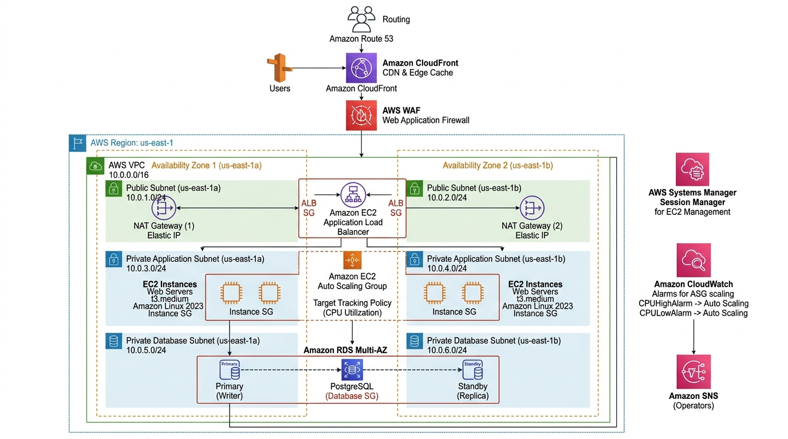

# Scalable Web Application with Application Load Balancer and Auto Scaling

[](https://aws.amazon.com/ec2/)
[](https://aws.amazon.com/well-architected/)
[](https://aws.amazon.com/waf/)
[](LICENSE)

A production-grade, highly available, and auto-scaling three-tier web application architecture deployed across two Availability Zones on Amazon Web Services. This solution follows the **AWS Well-Architected Framework Reliability and Security Pillars**, ensuring zero single points of failure, automated horizontal elasticity, and strict network perimeter defense.

---

## Table of Contents

- [Solution Overview](#solution-overview)
- [Architecture Diagram](#architecture-diagram)
- [AWS Services Used & Why](#aws-services-used--why)
- [Design Decisions & AWS Well-Architected Alignment](#design-decisions--aws-well-architected-alignment)
- [Network & Security Architecture](#network--security-architecture)
  - [CIDR Block Allocation](#cidr-block-allocation)
  - [Security Group Chaining](#security-group-chaining)
- [Cost Estimation & Optimization](#cost-estimation--optimization)

---

## Solution Overview

Enterprise web applications must withstand hardware faults, maintain responsive latency during traffic spikes, and defend against web exploits without manual intervention.

This architecture addresses these requirements through:
- **Zero Single Point of Failure (SPOF)**: Deployed across two Availability Zones (`us-east-1a` and `us-east-1b`) with automated failover for both compute and database tiers.
- **Bastion-Free Administration**: Eliminates traditional SSH jump boxes and exposed port `22` by leveraging **AWS Systems Manager Session Manager** with IAM role-based authentication.
- **Edge Acceleration & Filtering**: **Amazon CloudFront** caches static web assets at global edge locations while **AWS WAF** inspects HTTP/S requests against OWASP Top 10 vulnerabilities before traffic touches the origin.
- **Dynamic Capacity Management**: EC2 instances automatically scale out during traffic peaks and scale in during idle periods via target-tracking metric policies based on average CPU utilization.

---

## Architecture Diagram




---

## AWS Services Used & Why

| Service | Role in Architecture | Why We Chose This Service |
|---|---|---|
| **Amazon VPC** | Network Foundation | Provides complete logical isolation in the AWS Cloud. We configure distinct public subnets, private application subnets, and isolated database subnets across two Availability Zones to enforce defense-in-depth. |
| **Application Load Balancer (ALB)** | Ingress Traffic Distribution | Operates at Layer 7 (HTTP/HTTPS) to distribute traffic across targets in multiple Availability Zones. Supports advanced path/host routing, native AWS WAF integration, and automatic health checks to remove failed instances from the pool. |
| **Amazon EC2 & Auto Scaling Group (ASG)** | Compute Layer & Horizontal Elasticity | Runs our web application tier on modern AWS Graviton2 (`t4g.small`) instances for optimal price-performance. The Auto Scaling Group dynamically matches instance count to incoming traffic demand and self-heals by replacing unhealthy nodes automatically. |
| **Amazon RDS (PostgreSQL Multi-AZ)** | Managed Relational Persistence | Provides enterprise-grade relational database management with automated synchronous physical replication to a standby instance in a second Availability Zone. If the primary instance degrades, failover completes in under 60 seconds with zero data loss and no manual endpoint reconfiguration. |
| **Amazon CloudFront** | Global Content Delivery Network (CDN) | Caches static assets (images, CSS, JS) at Edge Locations closest to end users, drastically reducing origin load on the ALB and EC2 instances while minimizing page load latency. |
| **AWS WAF (Web Application Firewall)** | Edge Perimeter Security | Inspects incoming web traffic against OWASP Top 10 vulnerabilities (e.g., SQL Injection, Cross-Site Scripting) and mitigates layer 7 DDoS floods before malicious requests reach the application tier. |
| **AWS Systems Manager (Session Manager)** | Secure Bastion-Free Instance Management | Grants administrators secure, browser- or CLI-based shell access to private EC2 instances without requiring public IP addresses, opening inbound port 22, or managing SSH keys. |
| **Amazon Route 53** | Highly Available DNS Routing | Provides low-latency domain name resolution with Alias records directly mapped to CloudFront and ALB distributions, enabling health-checked routing and rapid failover. |
| **Amazon CloudWatch & SNS** | Monitoring, Logging & Alerting | Aggregates application and infrastructure metrics (CPU utilization, request count, HTTP 5xx error rates). Generates alarms that trigger automated Auto Scaling policies and deliver notifications via Amazon SNS. |

---

## Design Decisions & AWS Well-Architected Alignment

| Pillar | Architecture Decision | Technical Justification |
|---|---|---|
| **Reliability** | Multi-AZ ALB + Multi-AZ RDS | Eliminates data center-level SPOF. If `us-east-1a` fails, ALB routes 100% of traffic to `us-east-1b`, and RDS automatically promotes the standby replica in under 60 seconds with zero manual endpoint reconfiguration. |
| **Security** | Bastion-Free SSM & Private Compute | Compute instances reside strictly in private subnets with no public IPv4 addresses. Inbound port 22 is disabled across all security groups; engineers authenticate through IAM and SSM Session Manager with full CloudTrail session recording. |
| **Security** | Security Group Chaining | Security groups reference each other rather than IP ranges (`sg-alb` -> `sg-app` -> `sg-db`), ensuring strict least-privilege network isolation even if IP ranges shift. |
| **Performance** | CloudFront Edge Caching | Offloads static assets (CSS, JS, images) to edge PoPs, decreasing origin load by up to 70% and minimizing latency for geographically distributed users. |
| **Cost Optimization** | Dynamic Auto Scaling | Launch templates run `t4g.small` instances powered by AWS Graviton2 processors (20% better price-performance than x86). Instances scale dynamically between 2 and 6 nodes, preventing overprovisioning during off-peak hours. |
| **Operational Excellence** | CloudWatch Metric Alarms + Automated Health Checks | Health checks (`/healthz`) detect application runtime failures and automatically replace unhealthy nodes, maintaining consistent service availability. |

---

## Network & Security Architecture

### CIDR Block Allocation

The network uses a `/16` IPv4 VPC with non-overlapping `/24` subnets partitioned across two Availability Zones:

| Subnet Identifier | AZ | CIDR Block | Route Table Destination | Purpose |
|---|---|---|---|---|
| `Public-Subnet-1a` | `us-east-1a` | `10.0.1.0/24` | `0.0.0.0/0` -> Internet Gateway | ALB Node 1, NAT Gateway 1 |
| `Public-Subnet-1b` | `us-east-1b` | `10.0.2.0/24` | `0.0.0.0/0` -> Internet Gateway | ALB Node 2, NAT Gateway 2 |
| `Private-App-1a` | `us-east-1a` | `10.0.10.0/24` | `0.0.0.0/0` -> NAT Gateway 1 | EC2 Web Instances |
| `Private-App-1b` | `us-east-1b` | `10.0.20.0/24` | `0.0.0.0/0` -> NAT Gateway 2 | EC2 Web Instances |
| `Private-DB-1a` | `us-east-1a` | `10.0.30.0/24` | Local VPC Only (`10.0.0.0/16`) | RDS Primary Instance |
| `Private-DB-1b` | `us-east-1b` | `10.0.40.0/24` | Local VPC Only (`10.0.0.0/16`) | RDS Standby Replica |

### Security Group Chaining

```text
[ Internet: 0.0.0.0/0 ]
         │ (HTTP 80 / HTTPS 443)
         ▼
┌─────────────────────────┐
│     sg-alb (ALB)        │
└─────────────────────────┘
         │ (HTTP 80 only from source: sg-alb)
         ▼
┌─────────────────────────┐
│     sg-app (EC2)        │
└─────────────────────────┘
         │ (PostgreSQL 5432 only from source: sg-app)
         ▼
┌─────────────────────────┐
│     sg-db (RDS)         │
└─────────────────────────┘
```

#### Security Group Rules Definition

| Security Group | Inbound Type | Port | Source | Outbound Destination |
|---|---|---|---|---|
| **`sg-alb`** | HTTP / HTTPS | 80 / 443 | `0.0.0.0/0` (or CloudFront Prefix List) | TCP 80 to `sg-app` |
| **`sg-app`** | Custom TCP | 80 | Source ID: `sg-alb` | TCP 5432 to `sg-db`, TCP 443 to `0.0.0.0/0` (via NAT GW for SSM) |
| **`sg-db`** | PostgreSQL | 5432 | Source ID: `sg-app` | None (Isolated) |

---

## Cost Estimation & Optimization

Monthly estimated operational costs based on `us-east-1` pricing:

| Service | Configuration / Usage | Monthly Cost | Cost Optimization Strategy |
|---|---|:---:|---|
| **EC2 Web Instances** | 2x `t4g.small` instances (24/7) | $24.50 | AWS Graviton2 processors provide 20% lower cost than x86. Use 1-yr Savings Plans for an extra 35% discount. |
| **Application Load Balancer** | 1 ALB (~15 LCU-hours/mo) | $22.50 | Consolidate microservices onto path-based routing under a single ALB. |
| **NAT Gateways** | 2 Multi-AZ NAT Gateways + 10GB Data | $65.00 | In dev/test environments, consolidate to a single NAT Gateway in AZ-A. |
| **Amazon RDS Multi-AZ** | 1x `db.t4g.small` PostgreSQL (Multi-AZ) | $58.40 | In non-production, toggle to Single-AZ to halve the instance cost. |
| **Amazon CloudFront** | 50GB data transfer out + 1M requests | $4.50 | 1TB free tier per month covers development completely. |
| **AWS Systems Manager** | Session Manager standard usage | $0.00 | Free of charge (replaces dedicated bastion host saving ~$15/mo). |
| **Total Estimated Cost** | **Production Grade** | **~$174.90/mo** | **Dev/Free-Tier Optimized: ~$25.00/mo** |
