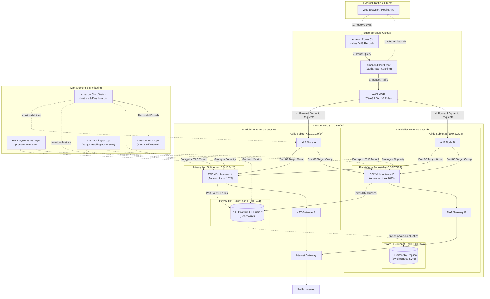

# Scalable Web Application with Application Load Balancer and Auto Scaling

[](https://aws.amazon.com/ec2/)
[](https://aws.amazon.com/well-architected/)
[](https://aws.amazon.com/waf/)
[](LICENSE)

A production-grade, highly available, and auto-scaling three-tier web application architecture deployed across two Availability Zones on Amazon Web Services. This solution follows the **AWS Well-Architected Framework Reliability and Security Pillars**, ensuring zero single points of failure, automated horizontal elasticity, and strict network perimeter defense.

---

## Table of Contents

- [Solution Overview](#solution-overview)
- [Architecture Diagram](#architecture-diagram)
- [Design Decisions & AWS Well-Architected Alignment](#design-decisions--aws-well-architected-alignment)
- [Network & Security Architecture](#network--security-architecture)
  - [CIDR Block Allocation](#cidr-block-allocation)
  - [Security Group Chaining](#security-group-chaining)
- [Step-by-Step Implementation Guide](#step-by-step-implementation-guide)
  - [1. Networking Foundation (VPC & Subnets)](#1-networking-foundation-vpc--subnets)
  - [2. Multi-AZ Database Layer](#2-multi-az-database-layer)
  - [3. Compute & Auto Scaling Group](#3-compute--auto-scaling-group)
  - [4. Load Balancer & Edge Security](#4-load-balancer--edge-security)
  - [5. Monitoring & Alarms](#5-monitoring--alarms)
- [Verification & Failure Simulation](#verification--failure-simulation)
- [Cost Estimation & Optimization](#cost-estimation--optimization)
- [Teardown & Cleanup](#teardown--cleanup)
- [Demo Video Recording Guide](#demo-video-recording-guide)

---

## Solution Overview

Enterprise web applications must withstand hardware faults, maintain responsive latency during traffic spikes, and defend against web exploits without manual intervention.

This architecture addresses these requirements through:
- **Zero Single Point of Failure (SPOF)**: Deployed across two Availability Zones (`us-east-1a` and `us-east-1b`) with automated failover for both compute and database tiers.
- **Bastion-Free Administration**: Eliminates traditional SSH jump boxes and exposed port `22` by leveraging **AWS Systems Manager Session Manager** with IAM role-based authentication.
- **Edge Acceleration & Filtering**: **Amazon CloudFront** caches static web assets at global edge locations while **AWS WAF** inspects HTTP/S requests against OWASP Top 10 vulnerabilities before traffic touches the origin.
- **Dynamic Capacity Management**: EC2 instances automatically scale out during traffic peaks and scale in during idle periods via target-tracking metric policies based on average CPU utilization.

---

## Architecture Diagram


<details>
<summary>Click to view Mermaid diagram markup</summary>


</details>

> **Note**: A vector format source file (`architecture.drawio`) is included in this directory. You can open and edit it in [draw.io](https://app.diagrams.net/) or [Lucidchart](https://lucid.app/).

---

## Design Decisions & AWS Well-Architected Alignment

| Pillar | Architecture Decision | Technical Justification |
|---|---|---|
| **Reliability** | Multi-AZ ALB + Multi-AZ RDS | Eliminates data center-level SPOF. If `us-east-1a` fails, ALB routes 100% of traffic to `us-east-1b`, and RDS automatically promotes the standby replica in under 60 seconds with zero manual endpoint reconfiguration. |
| **Security** | Bastion-Free SSM & Private Compute | Compute instances reside strictly in private subnets with no public IPv4 addresses. Inbound port 22 is disabled across all security groups; engineers authenticate through IAM and SSM Session Manager with full CloudTrail session recording. |
| **Security** | Security Group Chaining | Security groups reference each other rather than IP ranges (`sg-alb` -> `sg-ec2` -> `sg-rds`), ensuring network isolation even if IP ranges shift. |
| **Performance** | CloudFront Edge Caching | Offloads static assets (CSS, JS, images) to edge PoPs, decreasing origin load by up to 70% and minimizing latency for geographically distributed users. |
| **Cost Optimization** | Dynamic Auto Scaling | Launch templates run `t4g.small` instances powered by AWS Graviton2 processors (20% better price-performance than x86). Instances scale dynamically between 2 and 6 nodes, preventing overprovisioning during off-peak hours. |
| **Operational Excellence** | CloudWatch Metric Alarms + User-Data Automation | Instance provisioning is completely automated via launch template user-data. Health checks (`/healthz`) detect application runtime failures and automatically replace unhealthy nodes. |

---

## Network & Security Architecture

### CIDR Block Allocation

The network uses a `/16` IPv4 VPC with non-overlapping `/24` subnets partitioned across two Availability Zones:

| Subnet Identifier | AZ | CIDR Block | Route Table Destination | Purpose |
|---|---|---|---|---|
| `Public-Subnet-1a` | `us-east-1a` | `10.0.1.0/24` | `0.0.0.0/0` -> Internet Gateway | ALB Node 1, NAT Gateway 1 |
| `Public-Subnet-1b` | `us-east-1b` | `10.0.2.0/24` | `0.0.0.0/0` -> Internet Gateway | ALB Node 2, NAT Gateway 2 |
| `Private-App-1a` | `us-east-1a` | `10.0.10.0/24` | `0.0.0.0/0` -> NAT Gateway 1 | EC2 Web Instances |
| `Private-App-1b` | `us-east-1b` | `10.0.20.0/24` | `0.0.0.0/0` -> NAT Gateway 2 | EC2 Web Instances |
| `Private-DB-1a` | `us-east-1a` | `10.0.30.0/24` | Local VPC Only (`10.0.0.0/16`) | RDS Primary Instance |
| `Private-DB-1b` | `us-east-1b` | `10.0.40.0/24` | Local VPC Only (`10.0.0.0/16`) | RDS Standby Replica |

### Security Group Chaining

```text
[ Internet: 0.0.0.0/0 ]
         │ (HTTP 80 / HTTPS 443)
         ▼
┌─────────────────────────┐
│     sg-alb (ALB)        │
└─────────────────────────┘
         │ (HTTP 80 only from source: sg-alb)
         ▼
┌─────────────────────────┐
│     sg-app (EC2)        │
└─────────────────────────┘
         │ (PostgreSQL 5432 only from source: sg-app)
         ▼
┌─────────────────────────┐
│     sg-db (RDS)         │
└─────────────────────────┘
```

#### Security Group Rules Definition

| Security Group | Inbound Type | Port | Source | Outbound Destination |
|---|---|---|---|---|
| **`sg-alb`** | HTTP / HTTPS | 80 / 443 | `0.0.0.0/0` (or CloudFront Prefix List) | TCP 80 to `sg-app` |
| **`sg-app`** | Custom TCP | 80 | Source ID: `sg-alb` | TCP 5432 to `sg-db`, TCP 443 to `0.0.0.0/0` (via NAT GW for SSM) |
| **`sg-db`** | PostgreSQL | 5432 | Source ID: `sg-app` | None (Isolated) |

---

## Step-by-Step Implementation Guide

### 1. Networking Foundation (VPC & Subnets)

Create the VPC, subnets, route tables, and gateways using the AWS CLI:

```bash
# 1. Create VPC
VPC_ID=$(aws ec2 create-vpc --cidr-block 10.0.0.0/16 \
  --tag-specifications 'ResourceType=vpc,Tags=[{Key=Name,Value=production-vpc}]' \
  --query 'Vpc.VpcId' --output text)
aws ec2 modify-vpc-attribute --vpc-id $VPC_ID --enable-dns-hostnames '{"Value": true}'
aws ec2 modify-vpc-attribute --vpc-id $VPC_ID --enable-dns-support '{"Value": true}'

# 2. Create Internet Gateway & Attach
IGW_ID=$(aws ec2 create-internet-gateway \
  --tag-specifications 'ResourceType=internet-gateway,Tags=[{Key=Name,Value=prod-igw}]' \
  --query 'InternetGateway.InternetGatewayId' --output text)
aws ec2 attach-internet-gateway --vpc-id $VPC_ID --internet-gateway-id $IGW_ID

# 3. Create Subnets
PUB_SUB_A=$(aws ec2 create-subnet --vpc-id $VPC_ID --cidr-block 10.0.1.0/24 --availability-zone us-east-1a \
  --tag-specifications 'ResourceType=subnet,Tags=[{Key=Name,Value=public-1a}]' --query 'Subnet.SubnetId' --output text)
PUB_SUB_B=$(aws ec2 create-subnet --vpc-id $VPC_ID --cidr-block 10.0.2.0/24 --availability-zone us-east-1b \
  --tag-specifications 'ResourceType=subnet,Tags=[{Key=Name,Value=public-1b}]' --query 'Subnet.SubnetId' --output text)

APP_SUB_A=$(aws ec2 create-subnet --vpc-id $VPC_ID --cidr-block 10.0.10.0/24 --availability-zone us-east-1a \
  --tag-specifications 'ResourceType=subnet,Tags=[{Key=Name,Value=private-app-1a}]' --query 'Subnet.SubnetId' --output text)
APP_SUB_B=$(aws ec2 create-subnet --vpc-id $VPC_ID --cidr-block 10.0.20.0/24 --availability-zone us-east-1b \
  --tag-specifications 'ResourceType=subnet,Tags=[{Key=Name,Value=private-app-1b}]' --query 'Subnet.SubnetId' --output text)

DB_SUB_A=$(aws ec2 create-subnet --vpc-id $VPC_ID --cidr-block 10.0.30.0/24 --availability-zone us-east-1a \
  --tag-specifications 'ResourceType=subnet,Tags=[{Key=Name,Value=private-db-1a}]' --query 'Subnet.SubnetId' --output text)
DB_SUB_B=$(aws ec2 create-subnet --vpc-id $VPC_ID --cidr-block 10.0.40.0/24 --availability-zone us-east-1b \
  --tag-specifications 'ResourceType=subnet,Tags=[{Key=Name,Value=private-db-1b}]' --query 'Subnet.SubnetId' --output text)

# 4. Allocate Elastic IPs & Deploy NAT Gateways
EIP_A=$(aws ec2 allocate-address --domain vpc --query 'AllocationId' --output text)
NAT_GW_A=$(aws ec2 create-nat-gateway --subnet-id $PUB_SUB_A --allocation-id $EIP_A --query 'NatGateway.NatGatewayId' --output text)

# Wait for NAT Gateway to become available before adding routes
aws ec2 wait nat-gateway-available --nat-gateway-ids $NAT_GW_A
```

### 2. Multi-AZ Database Layer

Configure the DB subnet group and deploy an Amazon RDS Multi-AZ PostgreSQL instance:

```bash
# 1. Create DB Subnet Group
aws rds create-db-subnet-group \
  --db-subnet-group-name prod-db-subnet-group \
  --db-subnet-group-description "Private subnets for RDS Multi-AZ" \
  --subnet-ids $DB_SUB_A $DB_SUB_B

# 2. Launch Multi-AZ RDS PostgreSQL Instance
aws rds create-db-instance \
  --db-instance-identifier prod-app-db \
  --db-instance-class db.t4g.small \
  --engine postgres \
  --engine-version "15.4" \
  --master-username dbadmin \
  --master-user-password "ReplaceWithSecurePassword123!" \
  --allocated-storage 20 \
  --max-allocated-storage 100 \
  --multi-az \
  --db-subnet-group-name prod-db-subnet-group \
  --vpc-security-group-ids $SG_DB \
  --auto-minor-version-upgrade \
  --backup-retention-period 7 \
  --storage-encrypted
```

### 3. Compute & Auto Scaling Group

Create the IAM Instance Profile for Systems Manager, the Launch Template, and the Auto Scaling Group:

#### Launch Template User Data Script (`userdata.sh`)
```bash
#!/bin/bash
dnf update -y
dnf install -y httpd php php-pgsql
systemctl start httpd
systemctl enable httpd

# Create dynamic health check endpoint
cat << 'EOF' > /var/www/html/healthz
OK
EOF

# Create application landing page with metadata
cat << 'EOF' > /var/www/html/index.php
<!DOCTYPE html>
<html>
<head><title>Production Scalable Web Tier</title></head>
<body style="font-family: Arial, sans-serif; text-align: center; padding-top: 50px;">
  <h1>Enterprise Scalable Web Tier</h1>
  <p>Instance ID: <?php echo file_get_contents('http://169.254.169.254/latest/meta-data/instance-id'); ?></p>
  <p>Availability Zone: <?php echo file_get_contents('http://169.254.169.254/latest/meta-data/placement/availability-zone'); ?></p>
</body>
</html>
EOF
```

#### Launch Template & ASG Deployment Commands
```bash
# 1. Create Launch Template
aws ec2 create-launch-template \
  --launch-template-name prod-web-lt \
  --version-description "v1.0" \
  --launch-template-data "{
    \"ImageId\": \"ami-079db87dc4c10ac91\",
    \"InstanceType\": \"t4g.small\",
    \"IamInstanceProfile\": {\"Name\": \"EC2SSMInstanceProfile\"},
    \"SecurityGroupIds\": [\"$SG_APP\"],
    \"UserData\": \"$(base64 -w 0 userdata.sh)\",
    \"MetadataOptions\": {
      \"HttpTokens\": \"required\",
      \"HttpPutResponseHopLimit\": 1,
      \"HttpEndpoint\": \"enabled\"
    }
  }"

# 2. Create Target Group
TG_ARN=$(aws elbv2 create-target-group \
  --name prod-web-tg \
  --protocol HTTP \
  --port 80 \
  --vpc-id $VPC_ID \
  --health-check-protocol HTTP \
  --health-check-path /healthz \
  --health-check-interval-seconds 15 \
  --healthy-threshold-count 2 \
  --unhealthy-threshold-count 3 \
  --query 'TargetGroups[0].TargetGroupArn' --output text)

# 3. Create Auto Scaling Group
aws autoscaling create-auto-scaling-group \
  --auto-scaling-group-name prod-web-asg \
  --launch-template LaunchTemplateName=prod-web-lt,Version='$Latest' \
  --min-size 2 \
  --max-size 6 \
  --desired-capacity 2 \
  --vpc-zone-identifier "$APP_SUB_A,$APP_SUB_B" \
  --target-group-arns $TG_ARN \
  --health-check-type ELB \
  --health-check-grace-period 300

# 4. Attach Target Tracking Scaling Policy (Average CPU 60%)
aws autoscaling put-scaling-policy \
  --auto-scaling-group-name prod-web-asg \
  --policy-name target-cpu-60 \
  --policy-type TargetTrackingScaling \
  --target-tracking-configuration "{
    \"PredefinedMetricSpecification\": {
      \"PredefinedMetricType\": \"ASGAverageCPUUtilization\"
    },
    \"TargetValue\": 60.0,
    \"ScaleInCooldown\": 300,
    \"ScaleOutCooldown\": 60
  }"
```

### 4. Load Balancer & Edge Security

```bash
# 1. Deploy Internet-Facing Application Load Balancer
ALB_ARN=$(aws elbv2 create-load-balancer \
  --name prod-alb \
  --subnets $PUB_SUB_A $PUB_SUB_B \
  --security-groups $SG_ALB \
  --scheme internet-facing \
  --type application \
  --query 'LoadBalancers[0].LoadBalancerArn' --output text)

# 2. Create Listener forwarding to Target Group
aws elbv2 create-listener \
  --load-balancer-arn $ALB_ARN \
  --protocol HTTP \
  --port 80 \
  --default-actions Type=forward,TargetGroupArn=$TG_ARN

# 3. Associate AWS WAF WebACL to ALB
aws wafv2 associate-web-acl \
  --web-acl-arn $WAF_ACL_ARN \
  --resource-arn $ALB_ARN
```

---

## Verification & Failure Simulation

### 1. Load Balancer Routing & Health Check Verification
Execute 10 requests against the ALB DNS endpoint to confirm round-robin balancing across both Availability Zones:
```bash
ALB_DNS=$(aws elbv2 describe-load-balancers --load-balancer-arns $ALB_ARN --query 'LoadBalancers[0].DNSName' --output text)

for i in {1..10}; do
  curl -s http://$ALB_DNS | grep "Availability Zone"
  sleep 1
done
```
*Expected Output*: Output alternates between `us-east-1a` and `us-east-1b`.

### 2. Auto Scaling Self-Healing Test (Chaos Experiment)
Terminate one instance to verify the ASG automatically detects the failure and brings a replacement into service:
```bash
INSTANCE_TO_KILL=$(aws ec2 describe-instances \
  --filters "Name=tag:aws:autoscaling:groupName,Values=prod-web-asg" "Name=instance-state-name,Values=running" \
  --query 'Reservations[0].Instances[0].InstanceId' --output text)

echo "Terminating instance: $INSTANCE_TO_KILL"
aws ec2 terminate-instances --instance-ids $INSTANCE_TO_KILL

# Observe target health transition
watch -n 5 "aws elbv2 describe-target-health --target-group-arn $TG_ARN --query 'TargetHealthDescriptions[*].[Target.Id,TargetHealth.State]'"
```
*Expected Result*: Target state shifts to `unhealthy`/`unused`, ASG launches a replacement node, and the cluster returns to 2 healthy targets within 180 seconds with zero HTTP downtime on the ALB.

### 3. CPU Stress Test for Dynamic Scale-Out
Connect to an EC2 instance via Systems Manager Session Manager (no SSH key required) and simulate CPU load:
```bash
# Connect using AWS CLI
aws ssm start-session --target <TARGET_INSTANCE_ID>

# Inside the instance, generate CPU stress
sudo dnf install -y stress-ng
stress-ng --cpu 2 --timeout 300s &
```
*Expected Result*: CloudWatch metric `ASGAverageCPUUtilization` exceeds 60%, triggering the scaling policy to scale capacity up from 2 to 4 instances.

---

## Cost Estimation & Optimization

Monthly estimated operational costs based on `us-east-1` pricing:

| Service | Configuration / Usage | Monthly Cost | Cost Optimization Strategy |
|---|---|:---:|---|
| **EC2 Web Instances** | 2x `t4g.small` instances (24/7) | $24.50 | AWS Graviton2 processors provide 20% lower cost than x86. Use 1-yr Savings Plans for an extra 35% discount. |
| **Application Load Balancer** | 1 ALB (~15 LCU-hours/mo) | $22.50 | Consolidate microservices onto path-based routing under a single ALB. |
| **NAT Gateways** | 2 Multi-AZ NAT Gateways + 10GB Data | $65.00 | In dev/test environments, consolidate to a single NAT Gateway in AZ-A. |
| **Amazon RDS Multi-AZ** | 1x `db.t4g.small` PostgreSQL (Multi-AZ) | $58.40 | In non-production, toggle to Single-AZ to halve the instance cost. |
| **Amazon CloudFront** | 50GB data transfer out + 1M requests | $4.50 | 1TB free tier per month covers development completely. |
| **AWS Systems Manager** | Session Manager standard usage | $0.00 | Free of charge (replaces dedicated bastion host saving ~$15/mo). |
| **Total Estimated Cost** | **Production Grade** | **~$174.90/mo** | **Dev/Free-Tier Optimized: ~$25.00/mo** |

---

## Teardown & Cleanup

Run the following commands in sequence to delete all billable infrastructure:

```bash
# 1. Scale ASG to 0 and delete
aws autoscaling update-auto-scaling-group --auto-scaling-group-name prod-web-asg --min-size 0 --desired-capacity 0
aws autoscaling delete-auto-scaling-group --auto-scaling-group-name prod-web-asg --force-delete

# 2. Delete ALB and Target Group
aws elbv2 delete-listener --listener-arn $LISTENER_ARN
aws elbv2 delete-load-balancer --load-balancer-arn $ALB_ARN
aws elbv2 delete-target-group --target-group-arn $TG_ARN

# 3. Delete RDS Instance (Skip final snapshot for test environments)
aws rds delete-db-instance --db-instance-identifier prod-app-db --skip-final-snapshot

# 4. Release NAT Gateways & Elastic IPs
aws ec2 delete-nat-gateway --nat-gateway-id $NAT_GW_A
aws ec2 release-address --allocation-id $EIP_A

# 5. Delete VPC and Subnets
aws ec2 delete-vpc --vpc-id $VPC_ID
```

---

## Demo Video Recording Guide

If submitting the optional recorded demonstration, structure your 3 to 5-minute video as follows:

1. **Architecture Walkthrough (60 sec)**: Present the architecture diagram. Explain how the VPC is structured across two AZs with public, private app, and private database tiers.
2. **AWS Console Verification (90 sec)**:
   - Show the ALB in **EC2** > **Load Balancers** with its active Target Group showing two healthy EC2 targets.
   - Show the RDS Multi-AZ status indicating synchronous replication to the secondary AZ.
   - Access an EC2 instance via **Systems Manager Session Manager** to highlight bastion-free management.
3. **Live Traffic & Health Check (60 sec)**:
   - Send requests to the ALB public DNS name in the browser or terminal to show dynamic instance metadata responses.
4. **Self-Healing Simulation (60 sec)**:
   - Terminate an instance live in the AWS Console.
   - Show the ASG spinning up a fresh instance to restore desired capacity automatically.
